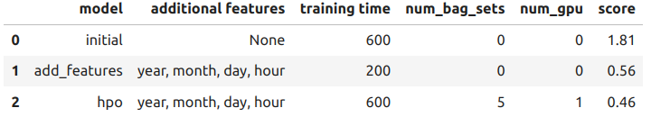
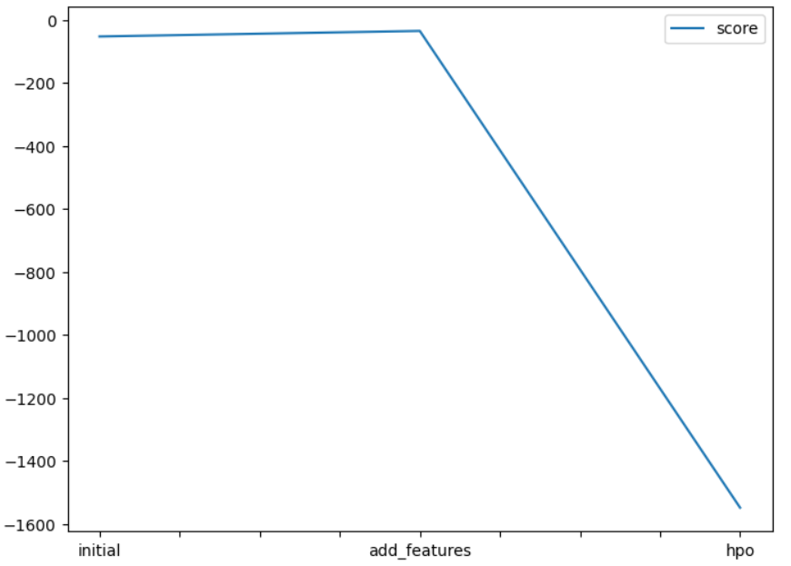
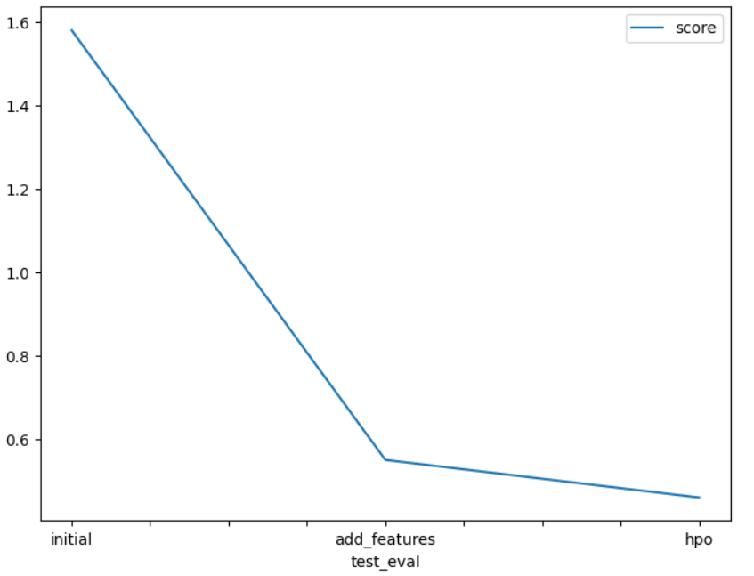

# Report: Predict Bike Sharing Demand with AutoGluon Solution
#### ALEJANDRO PENA

## Initial Training
### What did you realize when you tried to submit your predictions? What changes were needed to the output of the predictor to submit your results?
When I trained the first model, no change were needed. However, for the next ones I had to set to zero the negative values.

### What was the top ranked model that performed?
It was an ensemble model. 

## Exploratory data analysis and feature creation
### What did the exploratory analysis find and how did you add additional features?
I executed a correlation map and figured that the variables atemp and temp were highly correlated, so I just removed atemp.
About the feature engineering step, I just followed the instructions and separated the date into year, month, day and hour.

### How much better did your model preform after adding additional features and why do you think that is?
It was the MAJOR improvement. The score passed from 1.81 to 0.56.

## Hyper parameter tuning
### How much better did your model preform after trying different hyper parameters?
After I tried different hyperparameters, the best one was WeightedEnsemble_L2. I developed the project in my local machine and set the GPU to 1. I think it was the most relevant hyperparameter to reduce the score.
To improve the score, I should dive deep into hyperparameters tuning for this specific model, but I prefer to dedicate my time to other concepts and modules in this course.

### If you were given more time with this dataset, where do you think you would spend more time?
I would like to understand more the data. So, I'd spend more time doing explanatory analysis and creating feature engineering.
After that I'd definitely spend more time in hyperparameter tuning.

### Create a table with the models you ran, the hyperparameters modified, and the kaggle score.

### Create a line plot showing the top model score for the three (or more) training runs during the project.

### Create a line plot showing the top kaggle score for the three (or more) prediction submissions during the project.

## Summary
Autogluon is a great tool to quickly have a trained model. 
However, if you'd like to outperform, you need knowledge about hyperparameter tuning.
AWS documentation about autogluon it's limited. It only indicates global parameters like num_bags, num_gpu, etc. 
The hyperparameters argument need further explanation. I based some of my experiments on [this post](https://www.kaggle.com/code/crained/autogluon-automl-tuned-tps0822).
In my own experiments I would ideally start with some linear and lightweight algorithms (like svm, decision trees, etc) and apply a grid search on them. 
Then I'd try some algorithms whose hyperparameters I'm more familiar with, like dense neural networks.
For me, even if autogluon it's a great tool, I prefer to evaluate specific and separate algorithms.
